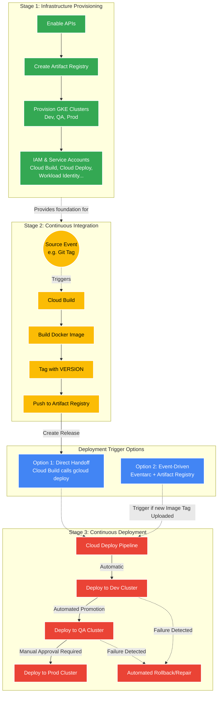

# CI/CD Pipeline Architecture

This document describes the end-to-end architecture and workflow for deploying the agent to Google Kubernetes Engine (GKE) using Google Cloud Build and Google Cloud Deploy. The pipeline is designed to be event-driven and supports a multi-environment promotion strategy (Dev, QA, Prod).

## Architecture Diagram



## Stage Descriptions

### 1. Infrastructure Provisioning
This foundational stage establishes the required Google Cloud environment. It is typically executed once per project or environment suite using infrastructure-as-code (IaC) tools like Terraform or setup scripts.

**Key Tasks:**
*   **API Activation:** Enables essential Google Cloud services, including Cloud Build, Cloud Deploy, GKE, Artifact Registry, and Vertex AI.
*   **Artifact Repository:** Creates a Docker repository in Artifact Registry to store and version agent images.
*   **GKE Environment:** Provisions three separate GKE Autopilot clusters to ensure strict isolation between Development (`dev`), Quality Assurance (`qa`), and Production (`prod`).
*   **Identity & Access Management (IAM):** 
    *   Configures the **Cloud Build Service Account** with permissions to push images to Artifact Registry and initiate deployments.
    *   Sets up a dedicated **Cloud Deploy Service Account** to automate cross-environment promotions.
    *   Creates a **Google Service Account (GSA)** with required AI permissions (e.g., Vertex AI User).
    *   Configures **Workload Identity** to allow the GKE Kubernetes Service Account (KSA) to securely impersonate the GSA.

### 2. Continuous Integration (CI)
The CI stage is triggered by source control events (e.g., a new Git Tag). It automates the transition from code to a versioned container image.

**Command:**
```bash
gcloud builds submit . \
    --config=cloudbuild.yaml \
    --substitutions=_APP_NAME="my-agent",_VERSION="v1.0.0",_GCP_PROJECT_ID="my-project"
```

**Workflow:**
1.  **Event Trigger:** A Git tag or push event triggers a Google Cloud Build pipeline.
2.  **Build & Tag:** Cloud Build packages the agent into a Docker image, tagging it with a specific `_VERSION` identifier.
3.  **Secure Push:** The image is pushed to the Artifact Registry repository for deployment.

### 3. Deployment Trigger Options (Handoff)
The handoff between build and deployment can be managed in two ways:

*   **Option 1: Direct Handoff (Synchronous):** The build process explicitly triggers the deployment after a successful push. This is a direct, hard-connected link where Cloud Build is responsible for initiating the deployment.
    ```bash
    gcloud deploy releases create "release-${_VERSION}" \
        --delivery-pipeline="my-agent-pipeline" \
        --region="us-central1" \
        --images="agent-image=us-central1-docker.pkg.dev/my-project/repo/image:${_VERSION}"
    ```
*   **Option 2: Event-Driven (Asynchronous):** This leverages **Google Cloud Eventarc** to monitor **Artifact Registry**. When a new image tag is successfully uploaded, Eventarc automatically triggers the Cloud Deploy pipeline. This approach completely decouples the build lifecycle from the deployment lifecycle, as the CI process has no knowledge of the deployment mechanism.

### 4. Continuous Deployment (CD)
The CD stage manages the lifecycle of the release across GKE environments using **Google Cloud Deploy** and **Skaffold**. This process ensures that every deployment is not only rolled out but also validated before progressing through the pipeline.

**Workflow:**
1.  **Dev Deployment:** The release is automatically deployed to the `dev` GKE cluster.
2.  **Automated Verification (Skaffold Verify):** 
    *   The pipeline uses **Skaffold** to orchestrate post-deployment verification.
    *   **Test Placeholders:** Two placeholder verification steps are configured: `verify-integration-test` and `verify-endpoint-test`.
    *   **Test Environment:** These tests are executed within the target GKE cluster using lightweight **Alpine Linux** containers. This ensures tests have direct access to the cluster's internal network to validate service connectivity.
3.  **Automated Promotion:** Once the verification steps in `dev` succeed, a Cloud Deploy **Automation** rule automatically promotes the release to the `qa` environment.
4.  **Production Gate:** Promotion to the `prod` cluster is gated by a manual approval requirement, providing a final safeguard for the live environment.
5.  **Automated Repair (Rollback/Repair):** 
    *   If a rollout or a verification step fails, Cloud Deploy's automated repair rules are triggered.
    *   The pipeline attempts up to 2 retries with linear backoff.
    *   If retries fail, the system automatically triggers a **Rollback** to the last stable release, maintaining system availability.

**Skaffold Configuration:**
The `skaffold.yaml` file defines the build artifacts and the `verify` rules. It ensures consistency across environments by using the same verification logic (running Alpine-based test containers) in Dev, QA, and Prod clusters.